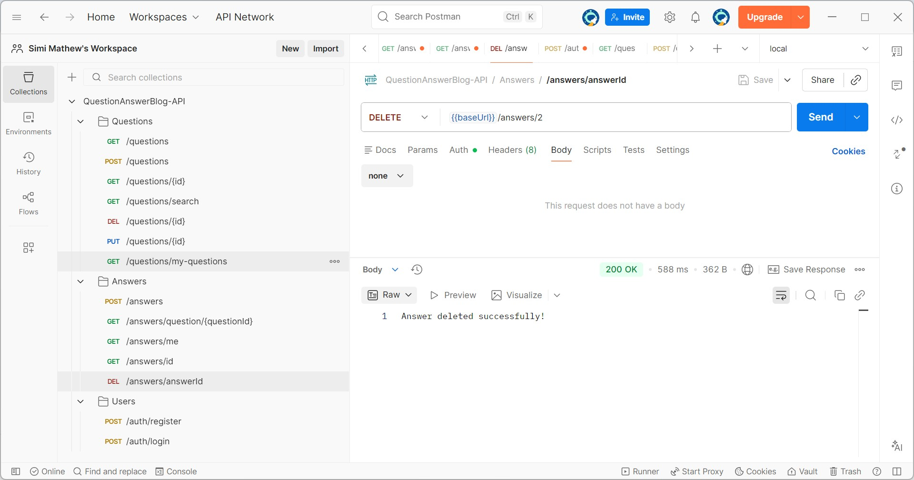

# Question Answer Blog Backend
A Spring Boot REST API for a Question & Answer blogging platform. 
Users can register, post questions, answer them, and interact with content. 
The backend handles authentication with JWT and role-based access (USER / ADMIN).

## Features
- User registration and login with JWT authentication
- Role-based access control (USER and ADMIN)
- CRUD operations for questions and answers
- Search questions by keywords
- Automatic password hashing with BCrypt
- Fetch answers by question or by user
- Clean layered architecture (Controller → Service → Repository)

# Screenshot of Postman collection testing



## Technologies
- Java 17+
- Spring Boot 3.x
- Spring Security with JWT
- PostgreSQL 18+
- Maven
- ModelMapper for DTO mapping
- application.yaml for configuration

## Setup
### 1. Clone the repository
```bash
git clone https://github.com/simimathew83/question-answer-blog-backend.git
cd question-answer-blog-backend
```
### 2. Configure PostgreSQL
- Open your PostgreSQL client (e.g., psql) and run:
```sql
CREATE DATABASE question_answer_db;
```

- Update your Spring Boot configuration
    - Edit application.yaml to connect to your database:
```YAML
spring:
  datasource:
    url: jdbc:postgresql://localhost:5432/question_answer_db
    username: <your-db-username>
    password: <your-db-password>
  jpa:
    hibernate:
      ddl-auto: update
```

### 3. Create an Admin user (Optional)
Insert directly in the DB using a BCrypt-hashed password for user `admin` 
with password `Admin123!` :
```sql
INSERT INTO users(username, email, password, role)
VALUES ('admin', 'admin@example.com', 
        '$2a$10$UE4ZnXtt51y8JmauluCzO.yu3LhBcderlcJFMNE.KTZk.ysnlXU9a', 'ADMIN');
```
#### Note
Make sure the password is hashed with BCrypt. By default, all new users are assigned the 
`USER` role.

## Running the Application
```bash
mvn spring-boot:run
```
The API will be available at:
http://localhost:8080

## API Endpoints (Examples)

### User
- POST /auth/register → Register new user
- POST /auth/login → Login and receive JWT

### Questions
- GET /questions → List all questions
- POST /questions → Create a new question
- GET /questions/search?query=<keyword> → Search questions

### Answers
- GET /answers/{id} → Fetch answer by ID
- POST /answers → Post a new answer

## Security
- JWT authentication is used for securing endpoints
- Public GET endpoints (no JWT required):
    - GET /questions
    - GET /questions/{id}
    - GET /questions/search?query=<keyword>
    - GET /answers/{id}
    - GET /answers/question/{questionId}
- Private GET endpoints (JWT required):
    - GET /questions/my-questions → fetch questions for the current user
    - GET /answers/me → fetch answers for the current user
- All POST, PUT, DELETE endpoints require authentication.

## Notes
- Passwords are hashed with BCrypt.
- Default role is USER
- ADMIN users must be created manually

## Future Enhancements
- Global exception handling
- Pagination for questions and answers
- Swagger/OpenAPI documentation
- Likes / voting system
- Comments on answers